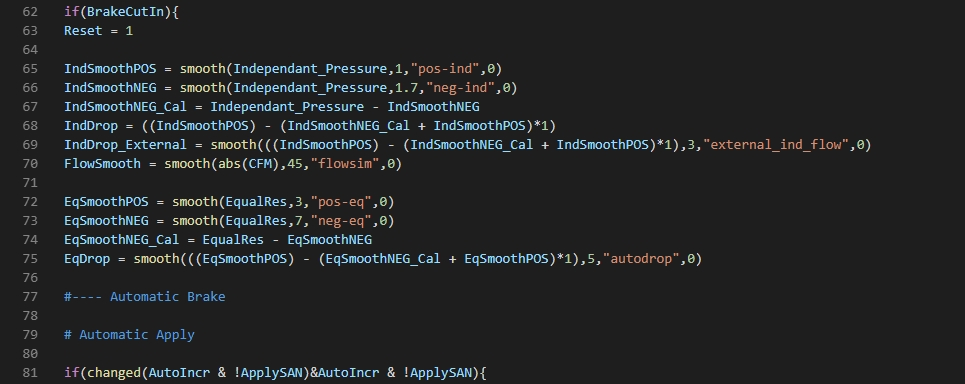

<p align="center">
  <a href="https://www.titusstudios.net/">
    
  </a>
</p>

<br>


PureAir Engine is an environment responsive air braking processor built on Wiremod's Expression 2 Environment.

# About

The PureAir Engine is the successor to my previous, "Titus's Triple Bypass Valve" Expression 2. PureAir is an Expression 2 that interfaces with [RLCPT Gamma](https://github.com/MagnumMacKivler/RLCPT2) and it's corresponding Control Reader E2. 

PureAir Engine uses the pre-calculated air brake pressure(s), brake pipe volume, and Air Flow in Cubic Feet per Minute (CFM) to calculate air brake application and releasing sound(s), duration(s), volume and pitch.

Ordinary RLC Gamma uses a predefined application and release sound, which if you had a long string of rollingstock behind the lead locomotive, the apply (and or release) sounds would not change (stay the same), if you had a smaller string of cars, hence, non-responsive. 

The PureAir Engine calculates the length of the train, and uses the air pressure and air flow rate to determine how long to play the application sound, how loud (volume) and then pitch (depending on situation), this also applies for releasing or any other changes between. PureAir simulates distribution valves and air leakage, furthermore adding to the realism.

<p align="center">
  <a href="https://www.titusstudios.net/">
    
  </a>
</p>

PureAir takes a responsive approach towards how it calculates the sound parameters, any and every aspect of the locomotives braking system and the trains braking system is taken into account, providing the most realistic experience for the driver. 

We are constantly updating the engine for better simulation, and for viering engines and setups. Will the HTTPS version checking system you can make sure you have the latest version with the best performance. Each release is rigorously tested before being published, to make sure of absolute quality, and to get rid of any bugs. PureAir Engine is made for developers, with the new Extensions folder for user made mods, expanding the possibilities, which are endless. We are always trying to improve our products for the best user experience possible, if you would like to request a feature or report a bug or glitch you found while using the PureAir Engine, or just a question, post it on the GitHub Issues Tab.

Thank You for using the PureAir Engine.


# Use

# Installation

# File Structure

* [_root](#_root)
  * [pureair-engine](#pureair-engine)
    * [config](#config)
      * `defaultengine.txt`
    * [extensions](#extensions)
    * [resources](#resources)
      * `entity-selection.txt`
    * [scripts](#scripts)
      * `delta-dampening.txt`
      * `localprint.txt`
      * `localsound.txt`
    * [workers](#workers)
      * `https-beginrequest-worker.txt`
      * `https-version-worker.txt`
      * `https-worker.txt`
    * `titus's_pureair_engine_processor.txt`

***

### _root
Root directory, most cases will be: `../data/expression2/`

### pureair-engine
PureAir Engine's main directory, all files reguarding the Engine are stored in here.

### Config
PureAir Engine config files. Contains engine config, defaults, etc.

### Extensions
PureAir Engine Extensions. User made addons (for the engine) will be added here, and accessed by the processor here.

### Resources
PureAir Engine Resources. Contains any; scripts, assets, lua, etc... that is used for getting info outside of the engine itself. Such as; BrightStar connection, RLCPT Gamma interface, sound emission entity source, etc.

### Scripts
All scripts for the main processor. Mostly used for external functions, for modification.

### Workers
Worker scripts. Pretty much everything to do with HTTP and HTTPS requests. Handles all requests for data on the internet.

***


# Defaults and Settings

The PureAir Engine, depending on the appilcation, has default sound settings which are siffcant in most cases. If however, you would like to change the preset defaults...

Navigate to `../pureair-engine/titus's_pureair_engine_processor.txt` and open the main processor using the in-game editor or [Microsoft Visual Studio Code](https://code.visualstudio.com/)

| NOTE | If you are using Visual Studio Code, set the plain text file(s) workspace to `C#` / `CSharp` or, download the [Expression 2 Workspace Extension](https://github.com/DjHaski/VSCode-E2) for Visual Studio Code |
| :--- | :--- |

The Default Sound Path and Sound Pitch settings are located under the Include Library

### Default Sound Settings:
```csharp

# SETTINGS

Automatic_application = "titus's_locomotive_propper_model_pack_2.4/loops/s_nippongallery_trainapplicationfull.wav"
Automatic_release_whine_FEATURE = 0
Automatic_release_whine = "titus's_locomotive_propper_model_pack_2.4/loops/s_nippongallery_brakereleasehisswhine.wav"
Automatic_release_flow = "titus's_locomotive_propper_model_pack_2.4/loops/s_f40ph_servicerelease.wav"

Independant_MasterPitch = 105
Independant_application = "titus's_locomotive_propper_model_pack_2.4/loops/s_nippongalleryserviceloop2.wav"
Independant_flow = "titus's_locomotive_propper_model_pack_2.4/loops/s_nippongallery_servicerelease.wav"

```

The PureAir Engine also has default engine settings, these can be found at `../pureair-engine/config/defaultengine.txt`

### Default Engine Settings
```csharp

E = entity()
O = owner()

SILENT = 0
DEBUG = 0

```

| NOTE | Editing the default sound, engine, or other script settings may cause unexpected results, preformance issues, or possible stability issues. |
| :--- | :--- |

